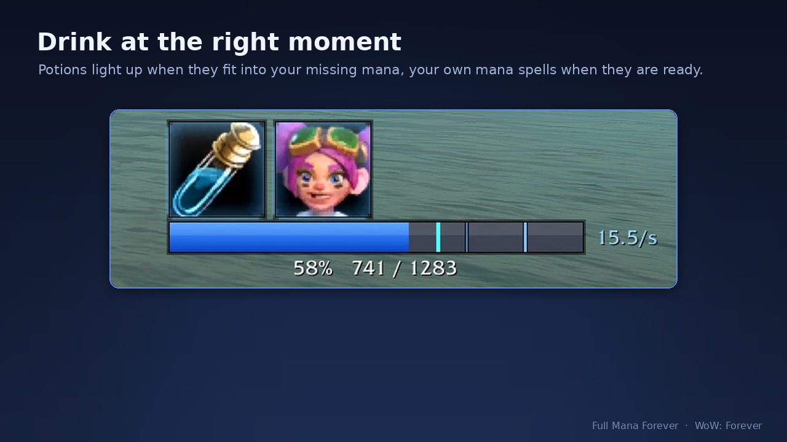
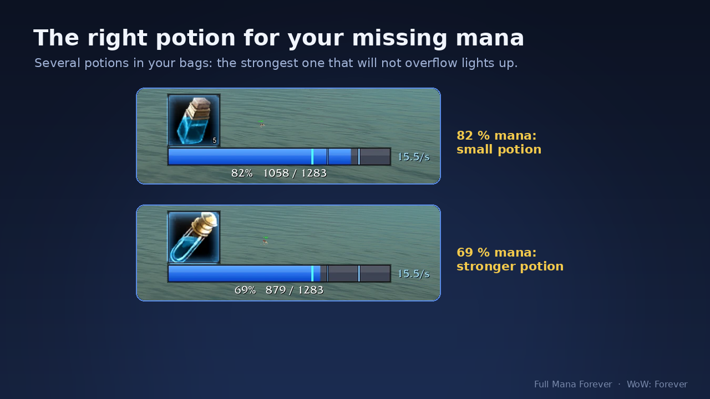
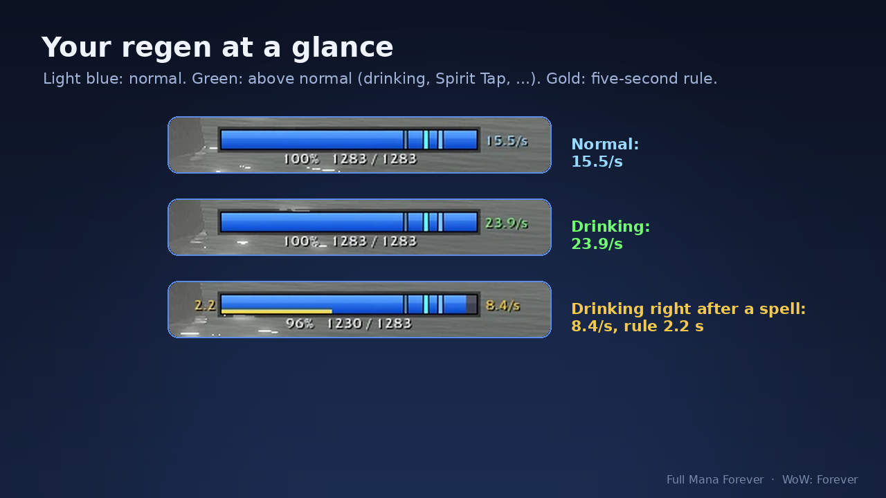
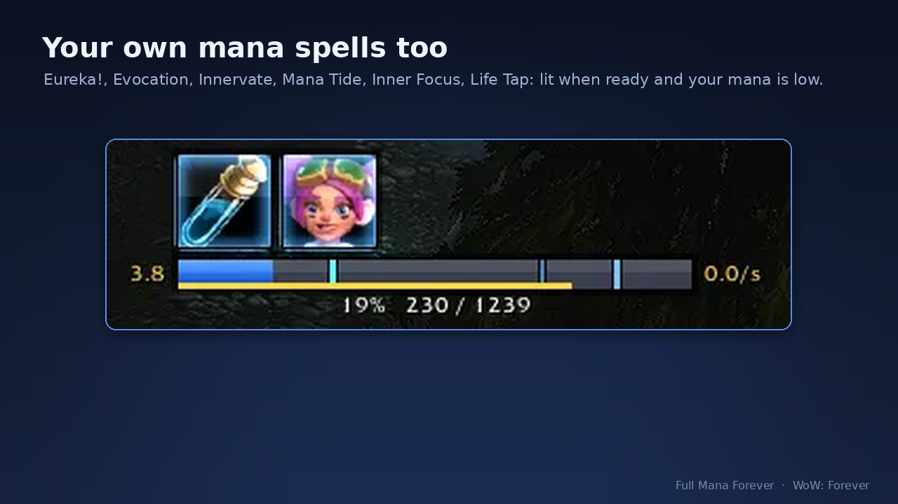

# Full Mana Forever – mana potion, five-second rule and mana regen addon for WoW Forever

[](https://github.com/KesaObscura/FullManaForever/releases/latest)
[](https://www.curseforge.com/wow/addons/full-mana-forever)
[](LICENSE)

An addon for **World of Warcraft: Forever** (WoW Forever, "Classic+", client 1.60.1) for healers
and every other mana user. It lights up your **mana potion**, Demonic/Dark Rune, mage mana gem,
mana item or **own mana spell** (Evocation, Innervate, Mana Tide Totem, Inner Focus, Life Tap,
Eureka!, Ley Line reading) **the moment it is ready and fits into your missing mana**, so nothing
is wasted: drink on cooldown, stay near full mana, and never panic-chug at 5 %. A compact mana bar
shows the **five-second rule (5SR)** and your **live mana regen per second, also in combat**.



| Right potion for the missing mana | Live regen and five-second rule | Own mana spells |
|---|---|---|
|  |  |  |

## How it works with Forever's addon rules

In Forever your current mana is a *secret value*: addons cannot read or compare it.
Full Mana Forever never tries to. It gives the game a step curve
(`C_CurveUtil` + `UnitPowerPercent`), the game evaluates it and returns a secret alpha,
and that alpha is applied straight to the icon. Nested frames multiply their alpha, which
gives "ready **and** deficit big enough (**and** enough health for runes)".
Item cooldowns, item counts and maximum mana are readable and handled normally.

The addon never uses an item for you. Put your potions on the action bar and press them
when the icon lights up.

## Features

- One icon per cooldown group: mana potions, Demonic/Dark Rune, mage mana gems, other
  mana consumables, and use effects of equipped gear.
- **Right potion for the deficit**: with several potions in your bags the icon shows the
  strongest one that will not overflow.
- **When to light up** setting: *No waste* (default) waits until the whole potion fits;
  *More per fight* uses the average restore (earlier, sometimes a small overflow);
  *Strongest only*.
- **Runes are safe**: shown only if you keep a set share of health after the rune
  (30 % by default).
- **Own mana spells**: Evocation, Innervate, Mana Tide Totem, Inner Focus, Life Tap and the
  racials Eureka! (gnome) and Ley Line reading (Skyborne) light up when ready and your mana
  is at or below a set share (50 % by default); Life Tap when its mana fits.
- **Mana bar with markers**: a thick marker where an icon lights up, thin ones where a
  stronger potion becomes the best fit. Icons in a row or a column, bar on any side;
  color, thickness, length, icon size and spacing are adjustable.
- **Five-second rule and mana regen** on the bar: a gold strip and the seconds after a spell
  that costs mana, and the regen running right now ("14.8/s"), also in combat. The regen turns
  green when it is above your normal rate. The mana numbers, the seconds and the regen also show
  without the bar, and each can be dragged anywhere ("Move texts freely").
- **Mana text** like the game's status text: number, percentage or both, with its own switch
  and text size.
- **Show**: solo / in a party / in a raid, optionally only in combat.
- **Sound when your potion is ready again** (optional, off by default): three sounds of the addon's own.
- **Item list** (`/fmf items`): every supported item, on/off per item, add your own.
- **Profiles**: one shared set of settings or own settings per character; copy another
  character's settings, reset, delete old ones ("Profiles..." in the settings, `/fmf profile`).
- 9 languages: English, Deutsch, Español (EU and AL), Français, Русский, 한국어, Português,
  简体中文, 繁體中文. The addon follows your game language.

Supported items and their restore values are in [`Data.lua`](Data.lua); they were checked
against the Wowhead Forever database (build 1.60.1). Dreamless Sleep Potion is off by
default because it puts you to sleep for 12 seconds.

## Looking for a mana tick or mp5 tracker?

Forever's mana regen is continuous: there are no 2-second mana ticks, and addons cannot read
your mana or regen in combat, so classic mana tick and mp5 trackers do not work there. Full Mana
Forever shows what counts in Forever instead: the five-second rule countdown after each spell
and the regen running right now, per second, in and out of combat.

## FAQ

- **Does it work in combat?** Yes, it was built and tested for combat in Forever.
- **Does it drink for me?** No. The icon tells you when; you press your potion button.
- **Does it work in WoW Classic Era, Hardcore or retail?** No. It is made for World of
  Warcraft: Forever (client 1.60.1) and its addon rules.
- **Why does the icon not light up at 90 % mana?** *No waste*: it waits until the whole potion
  fits into your missing mana. Switch *When to light up* to *More per fight* to drink earlier.
- **Different settings per character?** Yes: Shared or an own profile per character, and copy
  another character's settings.
- **Missing a feature?** Ask in the CurseForge comments or open an issue here: requests are
  read, and features asked for there get built.

## Install

Recommended: install it from [CurseForge](https://www.curseforge.com/wow/addons/full-mana-forever) (the CurseForge app keeps it up to date).

Manual install: download a release zip and unpack it into
`<your WoW Forever client folder>/Interface/AddOns/`. The result must be
`Interface/AddOns/FullManaForever/FullManaForever.toc`. If you use GitHub's
"Download ZIP", rename the folder from `FullManaForever-main` to `FullManaForever`,
otherwise the game does not load it.

## Commands

| Command | Does |
|---|---|
| `/fmf` | open the settings (also in Options → AddOns and the addon menu at the minimap) |
| `/fmf items` | open the item list |
| `/fmf profile` | profile in use and characters with own settings; `/fmf profile shared` / `own` switches, `copy <name>` takes over another character's settings, `undo` takes back the last copy |
| `/fmf hold` | hold mana potions until the end of the next fight (grey "HOLD" icon); again releases them. Tip: put it in a macro |
| `/fmf unlock` / `/fmf lock` | move the icons |
| `/fmf test` | same as `/fmf unlock`: show everything that is switched on, to place the frame |
| `/fmf item <id> <amount> [potion\|rune\|gem\|herb\|gear]` | add your own item |
| `/fmf item clear` | remove all own items |
| `/fmf probe` | print API status for bug reports |
| `/fmf log on` / `/fmf log off` | record what the game reports (casts, regen, in a group also the group's casts) for a bug report; `/fmf log clear` empties it |
| `/fmf probe 5sr` | 30 seconds of casts and regen in the chat, for bug reports |
| `/fmf scan` | write your spells, talents and items with a "Use:" effect into the log, for bug reports |
| `/fmf scan trainer` | with the addon TrainerSpells installed: every trainer spell of the mana classes into the log |
| `/fmf log chat` | test whether the addon may send chat and addon messages (whispers yourself; in a group also an invisible addon message to the group) |
| `/fmf debug` | debug messages on/off |
| `/fmf scale` | switch the curve scale 0..1 / 0..100 (only if icons never react) |
| `/fmf reset` | reset the position |
| `/fmf reset size` | reset icon size, icon spacing, bar thickness, bar length and the text sizes on the bar |

## Bug reports

Please open an [issue](https://github.com/KesaObscura/FullManaForever/issues) with the output of `/fmf probe`, your class and level, what you
did and what you expected. Lua errors are easiest to read with BugGrabber + BugSack.

For problems with the five-second rule or the regen display: `/fmf log on`, play until it
happens, `/fmf log off`, `/reload`, then attach
`WTF\Account\<account>\SavedVariables\FullManaForever.lua`. The log holds class, level,
casts, mana costs and regen values. In a group it also holds the names, classes and casts of
your group members: remove them before you share the file, if you like.

## Development

Plain Lua 5.1, no libraries, no Blizzard templates. Files load in TOC order:
`Locale.lua` → `Data.lua` → `Regen.lua` → `Spells.lua` → `Profiles.lua` → `Core.lua` → `Options.lua` →
`Library.lua` → `Diag.lua`.

Tests run outside the game against a small mock of the WoW API:

```
lua5.1 tests/run.lua
```

They cover the mana/cooldown logic, custom items, the UI windows, the locale tables
(every language has every key with the same placeholders) and a per-update performance
budget. The `tests` folder is not part of the release zip (see `.pkgmeta`).

**Translations**: all texts are in `Locale.lua`. Every language must have exactly the
keys of `enUS` with the same `%s`/`%d` placeholders; `tests/run.lua` checks that.

## License

[MIT](LICENSE)
